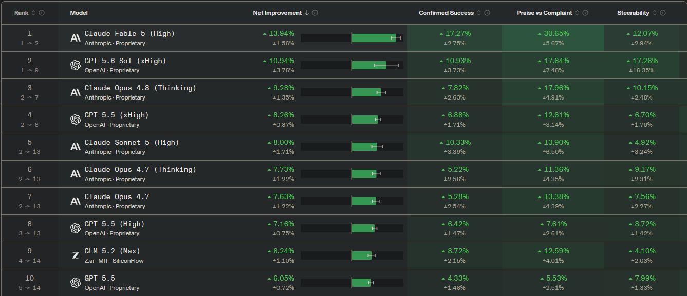

# Before Getting Started

I decided to structure this document around four fundamental questions:

* When will the model change?
* How will the model change?
* How will the model know when to change?
* How will the AI determine whether a change improved its performance?

This document will be continuously evolving as research progresses. Each category will be updated independently as new ideas, experiments, and discoveries are introduced.

Artificial intelligence tools may be used to assist with organizing, analyzing, and developing ideas. The specific AI used is not important for this process, as the differences between available tools are minimal for the purpose of organizing and developing these concepts :>

for the current leader board 7/13/2026 claude is ontop so ill stick with that

---

## When Will the Model Change

---

## How Will the Model Change

---

## How Will the Model Know When to Change -- priority 

---

## How Will the Model Know That a Change Made Itself Better --priority
